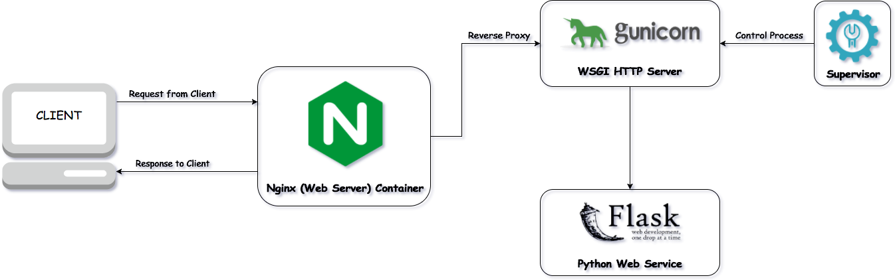

# SiminchikAudioProcessing
Processing of audio corpora for Qillqaq software

## GUNICORN - NGNIX - SUPERVISOR

Para la implementación usaremos las siguientes tecnologías:
Flask : servidor backend
Nginx : proxy inverso
Gunicorn : Para la implementacion de la aplicacion en FLASK
Supervisor : Monitoriza y controla el proceso de gunicorn. 



### Configuración GUNICORN
Para instalar Gunicorn ejecutar, si es necesario anteponer el SUDO.
```
pip install gunicorn
```
Para poder ejecutar varios procesos en simultaneo es necesario especificar los WORKERS,cada uno de los WORKERS es un proceso UNIX que carga la aplicación Python. No hay memoria compartida entre los WORKERS.
El número sugerido deworkers es (2*CPU)+1.
Para una máquina de doble núcleo (2 CPU), 5 es el workersvalor sugerido .
En este caso se esta colocando 8 WORKERS.
```
gunicorn -w 8  myproyect:application -b 0.0.0:5000
```


### Configuración NGNIX

## Instalación NGNIX en Linux

```
sudo apt-get update
sudo apt-get install nginx
```


### Configuración SUPERVISOR


```
[program:proyect]
directory=/home/ubuntu/proyect
command=/home/ubuntu/.env/bin/gunicorn -w 8  myproyect:application -b 0.0.0:5000
autostart=true
autorestart=true
stderr_logfile=/var/log/proyect/proyect.err.log
stdout_logfile=/var/log/proyect/proyect.out.log
```
Para habilitar la configuración, ejecute los siguientes comandos:

```
$ sudo supervisorctl reread
$ sudo service supervisor restart
```


## Automatización de pruebas en el servidor
La automatización de pruebas consiste en utilizar un programa para controlar la ejecución de pruebas y comprobar si los resultados obtenidos son los que estábamos esperando. 
### Pre-Requisitos
* Python 2.7
* Postman
* JRE
* Node.js
### Requisitos
* Newman
* Jenkins
#### Instalación de Newman


```
sudo npm install -g newman
```


#### Instalación de Jenkins
La versión de Jenkins incluida con los paquetes predeterminados de Ubuntu a menudo está detrás de la última versión disponible del propio proyecto. Para aprovechar las últimas correcciones y características, usaremos los paquetes mantenidos por el proyecto para instalar Jenkins.
Primero, agregaremos la clave del repositorio al sistema.
```
wget -q -O - https://pkg.jenkins.io/debian/jenkins-ci.org.key | sudo apt-key add -**
```
Cuando se agrega la clave, el sistema volverá OK. A continuación, agregaremos la dirección del repositorio de paquetes de Debian a los servidores sources.list:
```
echo deb https://pkg.jenkins.io/debian-stable binary/ | sudo tee /etc/apt/sources.list.d/jenkins.list
```
Cuando ambos estén en su lugar, ejecutaremos updatepara que apt-getutilicen el nuevo repositorio:
```
sudo apt-get update
```
Finalmente, instalaremos Jenkins y sus dependencias, incluyendo Java:
```
sudo apt-get install jenkins
```
Ahora que Jenkins y sus dependencias están en su lugar, iniciaremos el servidor Jenkins.
Paso 2 - Comenzando Jenkins
Usando systemctlcomenzaremos Jenkins:
```
sudo systemctl start jenkins
```
Ya systemctlque no muestra resultados, usaremos su statuscomando para verificar que se inició correctamente:
```
sudo systemctl status jenkins
```

## Ejecución de Tests
Paso1:
Descargar archivo de test en postman, coleccion , environment.

Paso2:
Ejecutar en newman 
```newman -c collection.json -e environment.json```

Paso3: Programando tarea en Jenkins
* Crear job en jenkins http://localhost:8080/

  Nombre del proyecto: Primer job (por ejemplo)
  
Build → Add build step → Execute Shell y escribimos la misma series de comandos que escribíamos para ejecutar Newman en local:
```
newman -c collection.json -e environment.json
```
* Programando tarea de ejecución diaria
Una vez cada dos horas a los 45 minutos después de la hora a partir de las 9:45 AM y terminando a las 3:45 PM todos los días de la semana.

Disparadores de ejecuciones → Ejecutar periódicamente → 45 9-16/2 * * 1-5

## Contact
Jean Carlos Torres Jacobo
jeantj98@gmail.com
